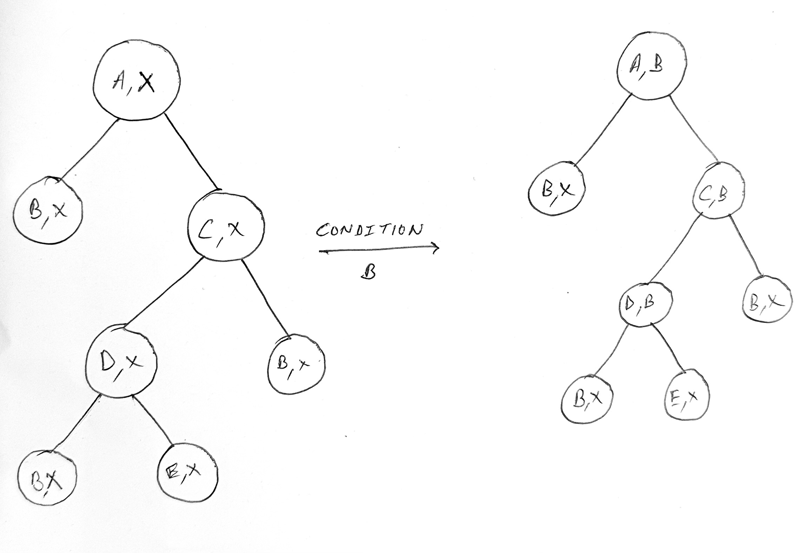

# Fast-FP-Trees

## Algorithm details and Optimizations
[This](https://github.com/integeruser/FP-growth) implementation by [integeruser](https://github.com/integeruser) obtained from GitHub reconstructed transactions from the FP-Tree to create every conditional FP-Tree. This can become extremely inefficient when the depth of the tree increases in the case of large datasets. Hence, me and [Aaryan Goyal](https://github.com/Aaryan231) came up with an optimized FP-growth and recovery algorithm to reuse the original FP-tree for all conditional trees in every recursion level. This implementation is structured as follows :

1. Nodes in the FP-Tree are wrapped with a node-wrapper _FPNodeWrapper_, which consists of a shared pointer to the node and shared pointers to the next and last Node-Wrapper in the linked list of the header table(the nodes itself were stripped of the pointers in the linked list to allow reuse).
2. The header table maps the item value to a _FPNodeWrapper_, which represents the start node of the concerned linked list of nodes in the FP-Tree.
3. Every node in the FP-Tree also stores the _conditional frequency_ and value of the item which it has been conditioned to. This will help in the recovery process to undo the conditioning.

  

4. To condition a tree with a given item, the algorithm iterates through the linked list of Node-Wrappers header table and for each node, the frequency is bubbled-up(updated on the conditional frequency) along with updation of the condition value. After this, a new header table is constructed for nodes with the given conditioning using a simple Depth-First Search.
5. To recover the fptree from conditioning, we iterate through the linked list of the header table for the conditioned item, and the conditional frequencies are updated for the concerned nodes by bubbling up the conditional frequencies of the children that were part of the tree before conditioning(This information is obtained from the initial conditioning and the value of the current conditioning).
6. All the references were created dynamically with shared and weak pointers to prevent memory leaks and allow efficient memory usage for deep recursions.